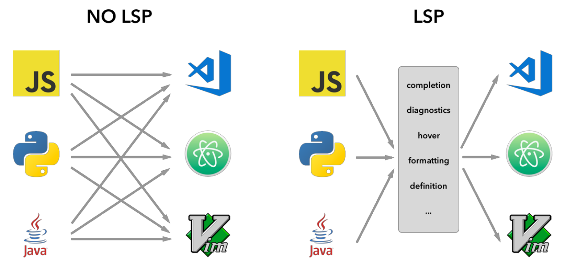
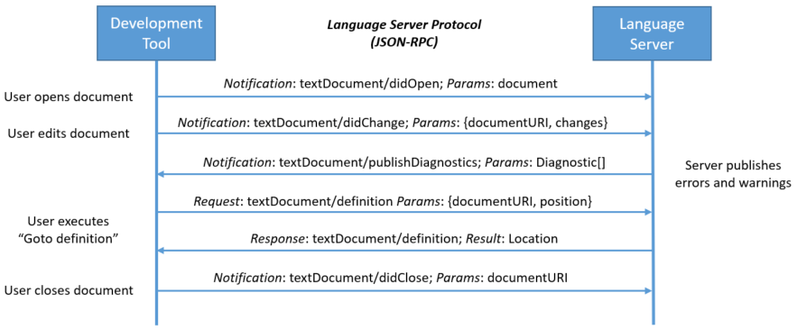

+++
title = "Language Server Protocol - Presentation"
outputs = ["Reveal"]
+++
## Why do we need LSP?

* Code editor should provide language support
* Standard approach: a new implementation for each language and editor
* Better approach: language server communicating with editor using standarized protocol




* IDE or simpler editor.
* autocompletion, goto definition, or documentation on hover
* server can be reused

WHAT EXACTLY SERVER GIVE US
SERVER SAVES FILES ON ITS SIDE
(IF THE LANGUAGE IS EXPOSED BY LSP ITSELF?)


---

## What is LSP?
* Protocol used between editors and servers that provide language support
* JSON-RPC-based
* Originally developed for Microsoft Visual Studio Code, now open standard


* Code completion, syntax highlighting, marking of warnings and errors, and help with refactoring
* RPC (Remote Procedure Call) is a protocol that allows a program to execute a procedure or function on a remote computer or server as if it were a local call, simplifying distributed application development by abstracting away the complexities of network communication.


---
{}

## Key concepts of LSP

---

### Overview

* **Client**: editor
* **Server**: language server
* Message exchange through stdio or socket




* Connection maintained until the exit notification is sent


---

### Multiple languages

* Typical implementation
* Separate language server for each programming language



* for a single project development tool usually starts 


---

### Capability

* Set of language features
* Client and server announce their supported features using capabilities
* Enables backward compatibility


* defined by the LSP specification

HOW DOES IT ENABLE BACKWARD CAPABILITY


{}

---

{}

## Messages

---

### Types of messages

1. **Request** — expects a response
2. **Response** — result of a request
3. **Notification**
   * treated as an event
   * must not get a response
   * does not have id



WHY DO WE NEED NOTIFICATIONS EVEN -> GIVE EXAMPLE LOGS



---

### Message structure

* **Header**
  * `Content-Lenght`
  * optional `Content-Type`; default: `application/vscode-jsonrpc;charset=utf-8`
* **Content**
  * `jsonrpc` -- version of JSON-RPC used, always equal to 2.0
  * the rest of the fields depend on the type of the message

```json
Content-Length: ...\r\n
\r\n
{
	"jsonrpc": "2.0",
	"id": 1,
	"method": "textDocument/completion",
	"params": {
		...
	}
}
```


* header + content like HTTP
* header separated by 2 endlines



---

#### Request
* `id`
* `method`
* optional `params`

```json
Content-Length: ...\r\n
\r\n
{
	"jsonrpc": "2.0",
	"id": 1,
	"method": "textDocument/completion",
	"params": {
		...
	}
}
```


* method - type/title
* params - content/data


---

#### Response
* `id`
* optional `result`
* optional `error`


```json
Content-Length: ...\r\n
\r\n
{
	"jsonrpc": "2.0",
	"id": 1,
	"result": {
		...
	}
}
```


* id correspondes to previous request
* EITHER result OR error
 

---

#### Notification
* `method`
* optional `params`

```json
Content-Length: ...\r\n
\r\n
{
	"jsonrpc": "2.0",
	"method": "initialized",
	"params": {
		...
	}
}
```


* we don't have id
  

{}

---

{}

## Server Lifecycle

---

### Phases


1. Initialization
2. Communication
3. Shutdown

---

### Initialization



* The whole lifecycle is managed by the client
* Establishing capabilities



WHAT WOULD HAPPEN IF WE DIDN'T PROVIDE INITIALIZATION


---

### Shutdown



* in result: null
  



WHY HAVING SHUTDOWN


---

### Other lifecycle capabilities

* registering new capabilities
* setting log preferences

{}

---
{}

## Document synchronization

---

### Mandatory capabilities

Notifications:
* didOpen -- transfers the whole document and locks the file
* didChange -- transfers changes
* didClose -- unlocks the file


* used for document synchronization
* server implements either all or none

WHAT WOULD HAPPEN WITHOUT OPENING THE FILE?


---

### Other document synchronization capabilities

* willing to save the document
* saving the document


* Renaming through close and open


---

### Example


{}


[//]: # (---)

[//]: # (## Sources)

[//]: # ()
[//]: # (* https://medium.com/@malintha1996/understanding-the-language-server-protocol-5c0ba3ac83d2)

[//]: # (* https://microsoft.github.io/language-server-protocol/overviews/lsp/overview/)
